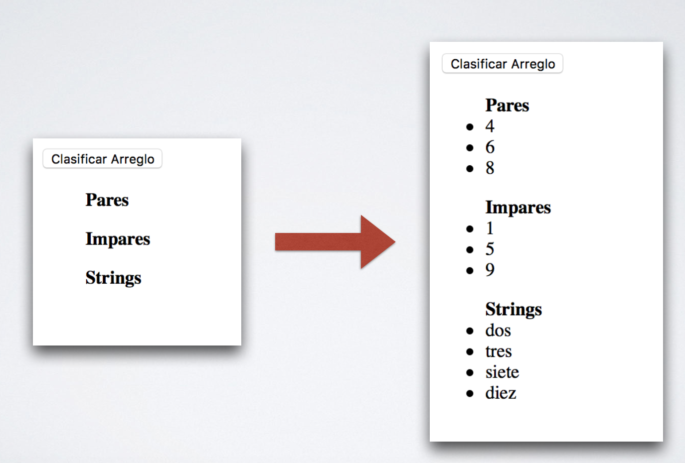

# Experiencia 23 - Actividad Presencial I
## JavaScript

El objetivo de esta actividad es aprender a crear e implementar funcionalidades de JavaScript en un sitio web.

#### Para realizar esta actividad debes haber visto los videos correspondientes a la semana 23.

## Ejercicio 1:

- Identificar y solucionar el problema en el siguiente bloque de código para que se muestre la suma de los números ingresados:

~~~html
<!DOCTYPE html>
<html>
  <head>
    <meta charset="utf-8">
    <title></title>
  </head>
  <body>
    
  </body>
</html>
~~~

## Ejercicio 2:

- Identificar el/los problema(s) en el siguiente bloque de código.
- El *alert* debe mostrar el mensaje "Eres mayor de edad" si la edad ingresada fue igual o mayor a 18.
- De lo contrario debe mostrar "Eres menor de edad".

~~~html
<!DOCTYPE html>
<html>
  <head>
    <meta charset="utf-8">
    <title></title>
  </head>
  <body>
    
  </body>
</html>
~~~

## Ejercicio 3:

- El siguiente código muestra 'hola' varias veces, pero debería mostrar todos los días específicados en el array, además estos días deben mostrados como elementos de una lista ordenada.

~~~html
<!DOCTYPE html>
<html>
  <head>
    <meta charset="utf-8">
    <title></title>
  </head>
  <body>
    <ol id="dias">
    </ol>
    
  </body>
</html>
~~~

## Ejercicio 4:

- Utilizando la sentencia **if** detener el conteo regresivo cuando el valor llegue a cero y cambiar el texto de bomba por "BOOM!" y el background-color de body a rojo.

> Hint: Busca la documentación del método **clearInterval()**

~~~html
<!DOCTYPE html>
<html>
  <head>
    <meta charset="utf-8">
    <title></title>
  </head>
  <body>
    <h1> ¡¡¡ La bomba !!! </h1>
    <h2 id="timer">15</h2>
    
  </body>
</html>
~~~

## Ejercicio 5:

- El siguiente código corresponde a una calculadora incompleta. 
- El botón '=' funciona evaluando la expresión dentro del input de texto.
- Se requiere:
	- Al presionar un dígito u operador este debe ser agregado al input.
	- Agregar los dígitos faltantes.
	- Agregar operadores faltantes (multiplicación y división).
	- Agregar un botón para limpiar el input.

~~~html
<!DOCTYPE html>
<html>
  <head>
    <meta charset="utf-8">
    <title></title>
  </head>
  <body>
    <input type="text" name="calculator" value="">
     
    <button class="btn" type="button" name="button">1</button>
    <button class="btn" type="button" name="button">2</button>
    <button class="btn" type="button" name="button">3</button>
    <button class="btn" type="button" name="button">4</button>
    <button class="btn" type="button" name="button">5</button>
    <button class="btn" type="button" name="button">6</button>
     
    <button class="btn" type="button" name="button">+</button>
    <button class="btn" type="button" name="button">-</button>
     
    <button class="result" type="button" name="result" onclick="calcTotal()">=</button>
    
  </body>
</html>
~~~

## Ejercicio 6:

- Se tiene la siguiente vista y script que incluye un arreglo.

~~~html
<!DOCTYPE html>
<html>
<head>
	<meta charset="utf-8">
	<meta http-equiv="X-UA-Compatible" content="IE=edge">
	<title></title>
</head>
<body>
    <button>Clasificar Arreglo</button> 
    <ul id="par">
        <strong>Pares</strong>
    </ul>
    <ul id="impar">
        <strong>Impares</strong>
    </ul>
    <ul id="string">
        <strong>Strings</strong>
    </ul>
    
</body>
</html>
~~~

##### Se requiere:

- Crear una función llamada sortList() la cual debe ser ejecutada al presionar el botón “Clasificar Arreglo”.

- La función debe iterar el arreglo:
	- Si el elemento del array es un número impar debe ser agregado a la lista ‘**Impares**’.
	- Si el elemento es un número par debe ser agregado a la lista ‘**Pares**’.
	- Si el elemento es un string debe ser agregado a la lista ‘**Strings**’.
- Los elementos deben ser agregados de manera dinámica manipulando el **DOM** mediante **JS**.

###### Screenshot referencia:

## Ejercicio 7:

- Se tiene la siguiente vista:

~~~html
<!DOCTYPE html>
<html>
<head>
	<meta charset="utf-8">
	<meta http-equiv="X-UA-Compatible" content="IE=edge">
	<title>JS Basics</title>
	
</head>
<body>

<ol class="todo" id="todo">
	<h3>To Do:</h3>
</ol>

<ol class="done" id="done">
	<h3>Done:</h3>
</ol>
</body>
</html>

~~~

- Y el siguiente arreglo de objetos:

~~~js

~~~

#### Se requiere:

- Agregar al script las instrucciones necesarias para que, al cargar la página, los objetos que poseen **completed:false** sean agregados de manera automática a la lista "**To Do**".

- Los objetos que posean **completed:true** deben ser agregados a la lista "**Done**"

- Generar un método llamado **completeTask()** que reciba como argumento el **id** del objeto y permita marcar un objeto (tarea) como completado, es decir:
	- El objeto debe cambiar estado a **completed:true**.
	- La tarea debe ser removida de la lista "**To Do**".
	- La tarea debe ser agregada, de manera dinámica, a la lista "**Done**".
